# Dependency Injection 全書精華：系統架構師的關鍵知識地圖

> **書籍**：Dependency Injection Principles, Practices, and Patterns
> **作者**：Steven van Deursen, Mark Seemann
> **整理視角**：資深系統架構師 — 聚焦對系統架構設計最重要的核心觀念
> **程式碼範例**：C#

---

## 一、DI 的本質：手段、途徑與目標

DI 不是目的，而是達成鬆散耦合的手段。全書圍繞一條核心鏈條展開：

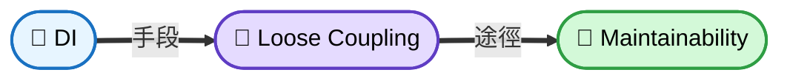

**架構師必須內化的三個核心認知：**

1. **DI 是設計思維，不是工具依賴** — 沒有 DI Container 也能做 DI（Pure DI）
2. **針對介面程式設計** — GoF 在 1994 年就說：「Program to an interface, not an implementation」
3. **DI 必須從專案初期就融入** — 無法輕易地把鬆耦合「補丁式」加到緊耦合的系統上

---

## 二、DI 的三大維度

DI 不只是「把依賴傳進去」，它涵蓋三個相互關聯的維度：

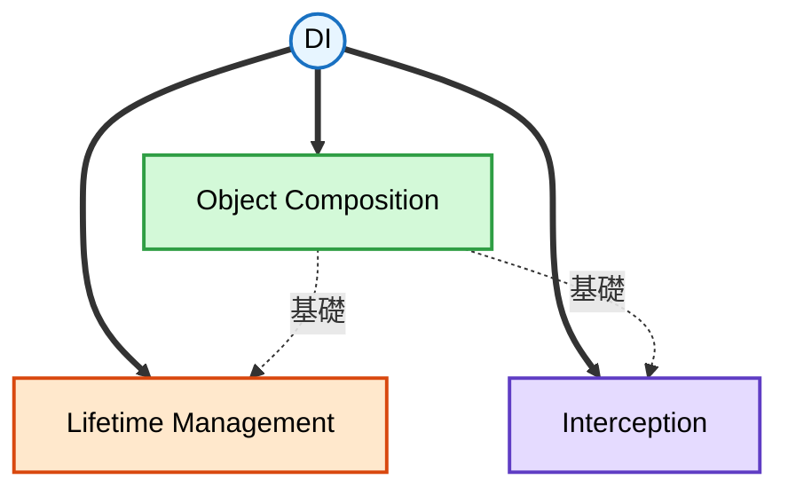

| 維度 | 核心問題 | 對應章節 |
|------|----------|---------|
| **Object Composition** | 誰負責建立物件？在哪裡組裝？ | Ch4, Ch7 |
| **Lifetime Management** | 物件活多久？誰共享？誰釋放？ | Ch8 |
| **Interception** | 如何在不改程式碼的情況下加入橫切關注點？ | Ch9, Ch10, Ch11 |

---

## 三、依賴分類：Stable vs Volatile

架構師面對每一個依賴時，第一個要問的問題就是：**它是穩定的還是易變的？**

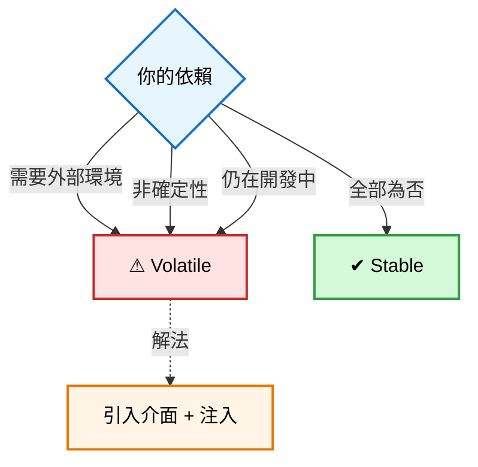

> **Volatile** = DB、API、MQ、DateTime.Now、檔案系統 → 必須透過 Constructor Injection 注入
>
> **Stable** = String、List、Math → 可直接使用

**判斷關鍵不在於「它是不是框架內建的」，而在於「它的行為是否可預測、是否需要外部環境、是否可能需要替換」。**

---

## 四、Composition Root：系統的「總控室」

**Composition Root 是整個應用程式中唯一知道所有具體實作的地方**，其他 99% 的程式碼只認識抽象介面。

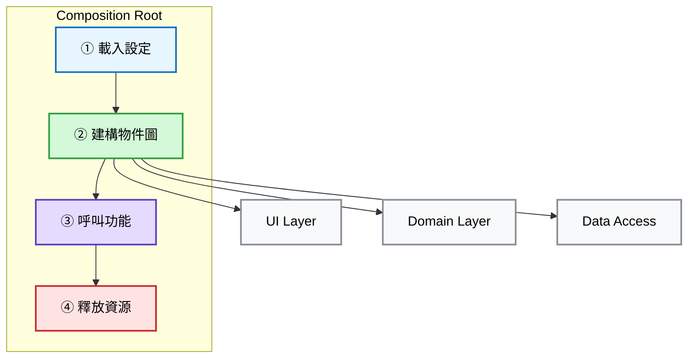

### 不同應用類型的 Composition Root 位置

| 應用類型 | 位置 | Seam |
|---------|------|------|
| Console App | `Program.Main()` | 直接控制 |
| ASP.NET Core | `Startup` + `IControllerActivator` | 框架提供 |
| UWP/WPF | `App.OnStartup()` | 手動設定 |

### 關鍵規則

- Composition Root **不是** UI 層（即使放在同一個 Assembly）
- 只有啟動專案有 Composition Root，類別庫不應該有
- DI Container 只能在 Composition Root 中使用

---

## 五、依賴反轉原則（DIP）：架構品質的決定性因素

**依賴方向決定架構品質。** 正確的架構不是「上層呼叫下層」這麼簡單，關鍵是依賴的方向必須指向核心層。

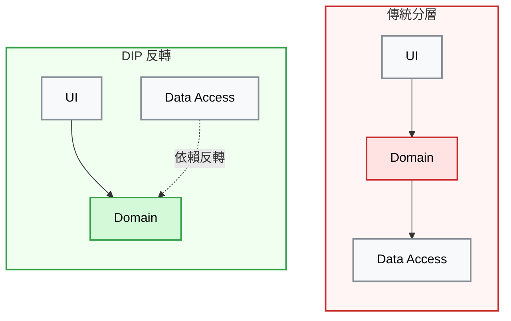

**DIP 的兩大要點：**

1. **高層模組不應依賴低層模組**，兩者都應依賴抽象
2. **抽象應由使用它的模組「擁有」**（介面定義在 Domain Layer，而非 Data Access Layer）

---

## 六、四大 DI 模式

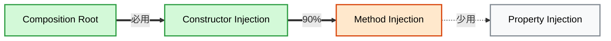

> **CR** = 每個專案必用 → **CI** = 90% 場景 → **MI** = Entity/外掛 → **PI** = 僅限函式庫提供預設值

### Constructor Injection 實作公式

```csharp
public class 消費者類別
{
    private readonly I依賴介面 _dep;       // 1. private readonly 欄位

    public 消費者類別(I依賴介面 dep)         // 2. 建構式參數
    {
        _dep = dep                          // 3. Guard Clause
            ?? throw new ArgumentNullException(nameof(dep));
    }

    public void 方法() => _dep.做事();       // 4. 直接使用，不需 null 檢查
}
```

### Constructor vs Method Injection 決策

| 問題 | 答案 | 選擇 |
|------|------|------|
| 長生命週期物件？（Service/Controller） | 是 | Constructor Injection |
| 短生命週期物件？（Entity/Value Object） | 是 | Method Injection |
| 在 Composition Root 建立？ | 是 | Constructor Injection |
| 由 ORM 或 Repository 建立？ | 是 | Method Injection |

---

## 七、四大反模式

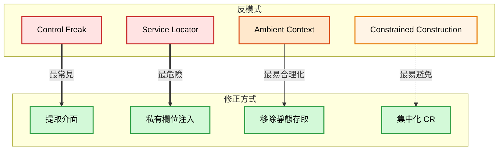

| 反模式 | 嚴重度 | 問題描述 |
|--------|--------|---------|
| **Control Freak** | ★★★★★ | 在 Composition Root 外 `new` Volatile Dependency |
| **Service Locator** | ★★★★☆ | 隱式索取依賴，隱藏真實依賴關係 |
| **Ambient Context** | ★★★☆☆ | 靜態全域存取單一依賴 |
| **Constrained Construction** | ★★☆☆☆ | 強制統一建構式簽章 |

### Service Locator vs DI 的本質差異

**Service Locator**（反模式）= 自助餐：你自己去取餐檯挑菜，你**主動去找**依賴
**Dependency Injection**（正確做法）= 點餐制：服務生把菜端到你面前，你**被動接收**依賴

**核心判斷標準**：DI Container 在 Composition Root 中使用 = 合法；在應用程式碼中使用 = Service Locator 反模式。

---

## 八、三大 Code Smell 與重構策略

### 8.1 Constructor Over-injection

當建構式參數超過 4 個，代表類別承擔太多責任（SRP 違規）。

**漸進式重構路徑：**

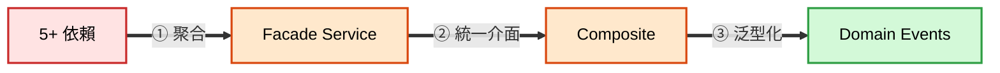

### 8.2 Abstract Factory 濫用

| 場景 | 問題 | 解法 |
|------|------|------|
| 無參數 Create 方法 | Leaky Abstraction | Proxy 模式 |
| 依執行期資料選擇依賴 | 暴露服務抽象 | Adapter 模式 |

### 8.3 Cyclic Dependencies

**根因分析步驟：**
1. 畫出物件依賴圖，標示循環路徑
2. 找到方法最多的介面 — 它最可能是 SRP 違規的元凶
3. 拆分介面（ISP），讓消費者只依賴真正需要的部分

---

## 九、物件生命週期管理

### 三大 Lifestyle

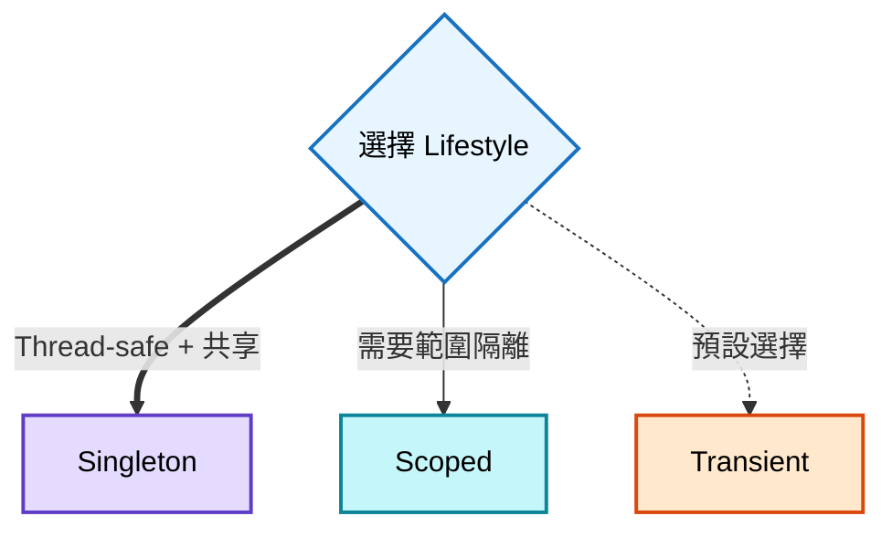

| Lifestyle | 比喻 | 特性 |
|-----------|------|------|
| **Singleton** | 公司唯一一台印表機 | 整個應用共享一個實例 |
| **Transient** | 用完即丟的紙杯 | 每次注入都建新的 |
| **Scoped** | 每桌客人共用一壺茶 | 範圍內共享，跨範圍獨立 |

### Captive Dependency（被俘虜的依賴）

**黃金法則：Dependency 的壽命 >= Consumer 的壽命，否則就是 Captive Dependency。**

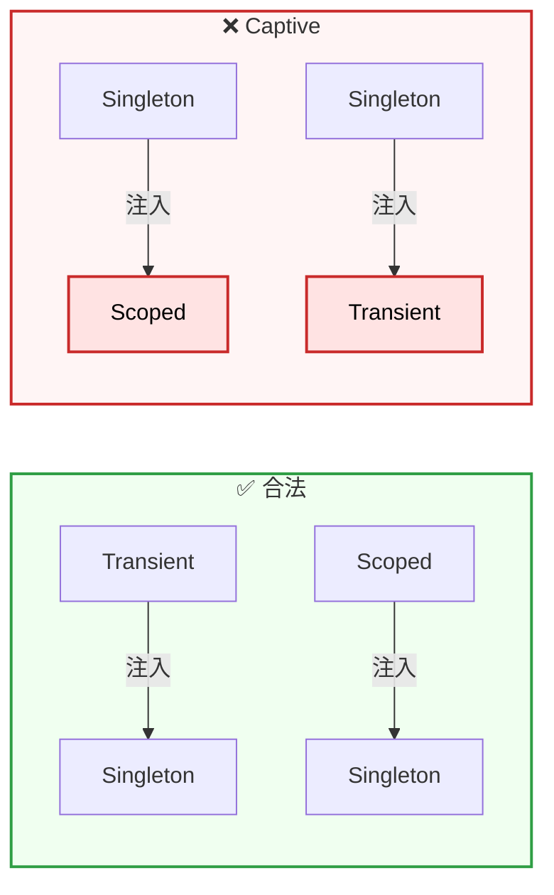

### 防範方式：三階段建立法

1. **Phase 1 - App 啟動**：建立所有 Singleton（存在 Composer 的 private readonly fields）
2. **Phase 2 - Request 開始**：建立所有 Scoped（存在 local variables）
3. **Phase 3 - 組裝物件圖**：建立 Transient 並混合注入

### 關鍵原則

- **Consumer 不管依賴的生死** — 這是 Composer 的職責
- **不要讓介面繼承 IDisposable** — 那是 Leaky Abstraction
- **Disposal 以建立的反序進行** — 外層先 Dispose
- **永遠不要使用 Per-Thread Lifestyle** — 在 async 世界中是定時炸彈，改用 Scoped

---

## 十、攔截與 AOP：真正收穫 DI 價值的地方

### Decorator 模式：攔截的核心手法

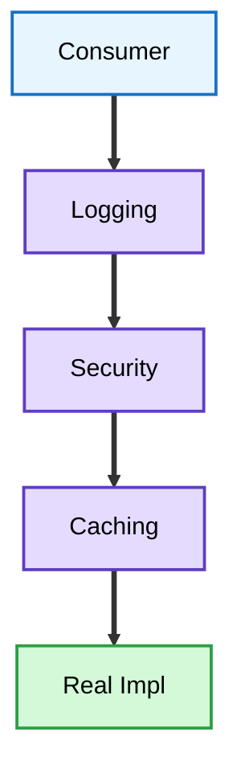

> Consumer 只認識 `IService`，不知道中間經過幾層 Decorator — 這就是 LSP 的威力

**Decorator 的三種行為模式：**
- **委派 (Delegate)**：前後加料，核心呼叫不變（如 Logging）
- **修改 (Modify)**：改變輸入或輸出（如 Caching）
- **短路 (Short-circuit)**：條件不滿足時不呼叫核心（如 Authorization、Circuit Breaker）

### SOLID 驅動的 AOP（第 10 章核心）

這是全書**最具架構洞察力**的部分。透過 SOLID 原則重構，從膨脹的 `IProductService` 演化成泛型的 `ICommandService<TCommand>`：

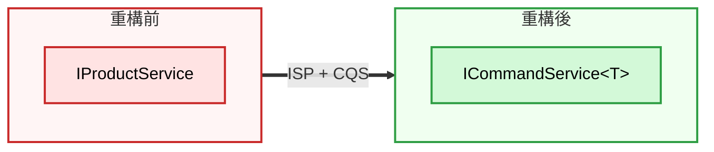

> `IProductService` 有 N 個方法且持續增長 → 重構為單一方法 `Execute(TCommand)` 的泛型介面

**Decorator Pipeline：**

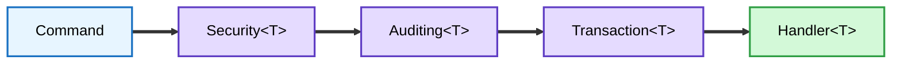

> 一個泛型 Decorator 就能解決一個橫切關注點，套用到**所有**業務操作上

```csharp
// 一個 Decorator 解決所有命令的交易管理
public class TransactionDecorator<TCommand> : ICommandService<TCommand>
{
    private readonly ICommandService<TCommand> decoratee;

    public void Execute(TCommand command)
    {
        using (var scope = new TransactionScope())
        {
            this.decoratee.Execute(command);
            scope.Complete();
        }
    }
}
```

### AOP 策略優先順序

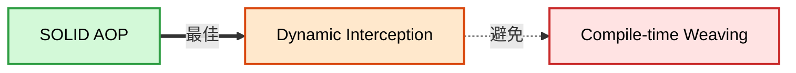

---

## 十一、Pure DI vs DI Container 決策

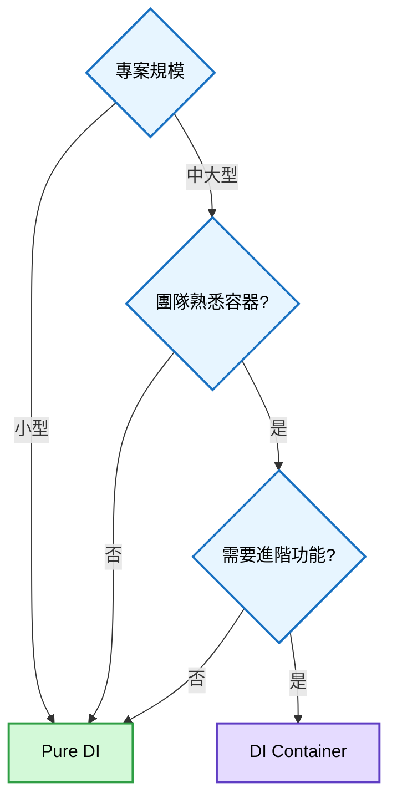

> **進階功能** = Late Binding、Auto-Registration、大量 Decorator 支援

### DI Container 選型

| 容器 | 特色 | 適用場景 |
|------|------|---------|
| **Autofac** | 功能豐富、社群活躍、Module 系統 | 大型企業應用 |
| **Simple Injector** | 嚴格驗證、自動偵測 Captive Dependency | 重視正確性的團隊 |
| **MS.DI** | 內建、最小化、無原生 Decorator 支援 | 簡單應用或框架整合 |

**MS.DI 的限制**：缺乏 Auto-Registration、原生 Decorator/Composite 支援、不偵測 Captive Dependency。作者明確建議：對有一定規模的鬆耦合應用，MS.DI 功能不足。

---

## 十二、架構師的完整思考模型

面對每一個設計決策時，問自己這些問題：

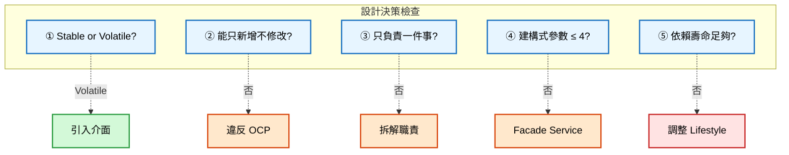

| 檢查項 | 觸發條件 | 行動 |
|--------|---------|------|
| ① Stable or Volatile? | Volatile | 引入 Seam（介面），透過 Constructor Injection 注入 |
| ② 能只新增不修改? | 否 | 違反 OCP，需重構為 Decorator/Composite |
| ③ 只負責一件事? | 否 | 拆解 + Decorator/Composite 組合 |
| ④ 建構式參數 ≤ 4? | 否 | SRP 違規，考慮 Facade Service |
| ⑤ 依賴壽命足夠? | 否 | Captive Dependency，調整 Lifestyle |

---

## 十三、全書設計模式速查表

| 模式 | 用途 | 一句話比喻 |
|------|------|-----------|
| **Constructor Injection** | 宣告必要依賴 | 上班前必須帶好的裝備 |
| **Method Injection** | 短命物件的依賴傳遞 | 執行任務時臨時借用的工具 |
| **Composition Root** | 集中組裝物件圖 | 大樓的總控室 |
| **Decorator** | 疊加橫切關注點 | 俄羅斯套娃，一層包一層 |
| **Composite** | 多個實作統一對外 | 群組訊息，發一次所有人收到 |
| **Adapter** | 轉換不相容介面 | 出國旅行的萬用插頭轉接器 |
| **Proxy** | 封裝生命週期管理 | 飯店禮賓，幫你處理所有細節 |
| **Null Object** | 取代 null 的空實作 | 沉默的傾聽者，微笑點頭不行動 |
| **Facade Service** | 聚合多個依賴 | 部門經理，外人只找經理 |

---

## 十四、SOLID 原則在 DI 中的具體體現

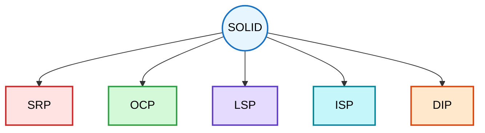

| 原則 | DI 中的體現 |
|------|-----------|
| **SRP** | Constructor Over-injection = 違規信號；循環依賴的根因通常是 SRP 違規 |
| **OCP** | Decorator + Composite 新增功能不改既有碼；Domain Events 實現完美 OCP |
| **LSP** | Consumer 不知道拿到的是真實實作還是 Decorator；Lifestyle 切換不影響行為 |
| **ISP** | 過胖介面需拆分；`ICommandService<T>` 是 ISP 的極致 |
| **DIP** | 介面由使用者擁有（非實作者）；依賴方向指向核心層 |

---

## 十五、Code Review 檢查清單

在 Code Review 時，架構師應檢查以下項目：

- [ ] 是否有在 Composition Root 以外的地方 `new` Volatile Dependency？（Control Freak）
- [ ] 是否有 `ServiceLocator.GetService<T>()` 出現在應用程式碼中？
- [ ] 建構式參數是否超過 4 個？
- [ ] 介面是否繼承了 `IDisposable`？
- [ ] 是否有無參數 `Create()` 方法的 Abstract Factory？
- [ ] 是否有循環依賴（編譯錯誤或執行期 StackOverflow）？
- [ ] Singleton 元件是否注入了 Scoped 或 Transient 的依賴？（Captive Dependency）
- [ ] 是否有使用 `[ThreadStatic]` 或 Per-Thread Lifestyle？
- [ ] 是否有 `Lazy<T>` 或 `IEnumerable<T>` 直接注入消費者？（應用 Proxy/Composite）
- [ ] Domain Layer 是否有依賴外部模組？（DIP 違規）

---

## 最後的話

> **緊耦合是自然產生的，鬆耦合是刻意設計的。**

DI 的開銷是固定的，但好處隨著系統複雜度成長而**倍增**。作為架構師，你的職責不只是讓程式碼能運作，而是讓它在面對變化時仍然能優雅地演進。DI 不是銀彈，但它是你手中最可靠的設計武器之一。
